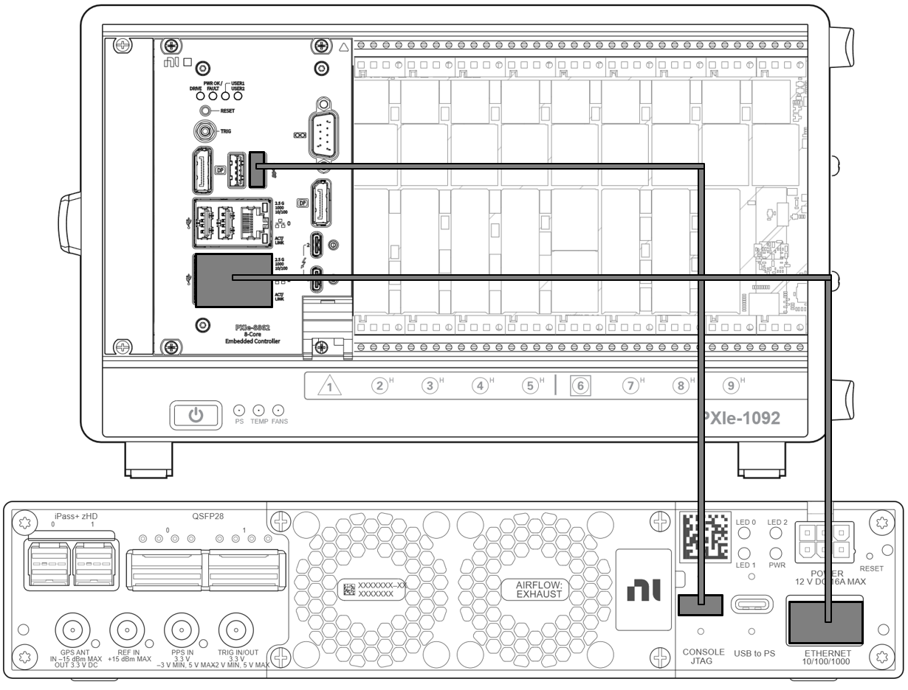
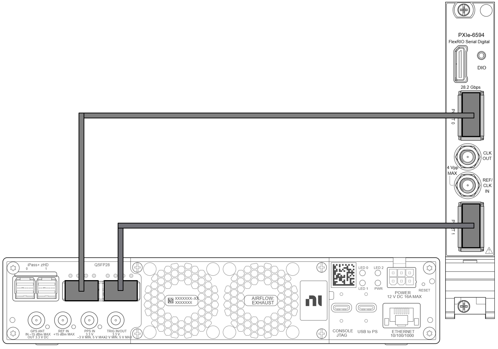
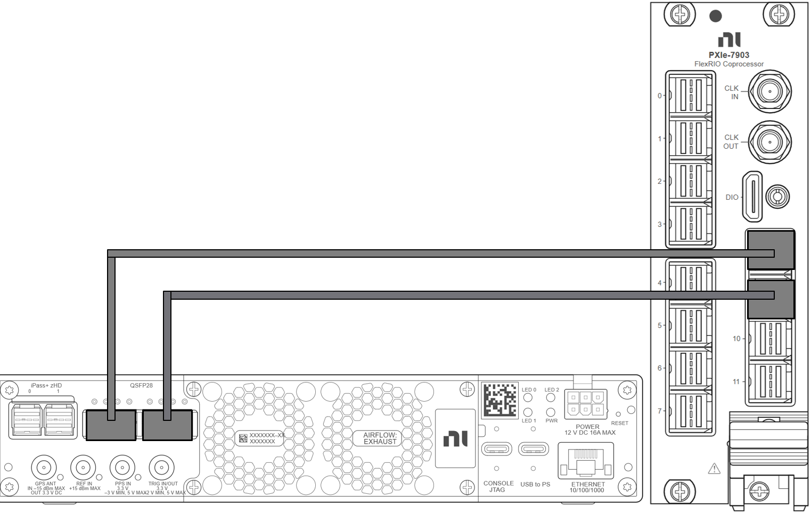

# USRP Data Link Example

NI Data Link Test Framework (DLTF) is a software framework designed to simplify the creation, configuration, and control of high-speed Multi-Gigabit Transceiver (MGT) data streaming links between FPGA-based NI hardware devices. It is primarily used in real-time Hardware-in-the-Loop (HIL) and Digital Signal Processing (DSP) applications where extremely high data throughput is required.
This repository contains the architecture and example code demonstrating how to integrate a USRP with the Data Link Test Framework. It uses the USRP Aurora FPGA bitfile to establish a high-speed data link with an NI High-Speed Serial coprocessor, enabling efficient I/Q data streaming and seamless integration of USRP-based systems into DLTF-powered HIL, DSP, and communications test environments.

## Key Features

The NI USRP Data Link Test Framework provides the following features and capabilities:
- I/Q data streaming between supported devices up to **1.25 GS/s per channel** (1 GHz instantaneous bandwidth) per direction.
- Support for multichannel streaming of supported USRP devices.
- Support for multiple streaming endpoints on a PXIe-7903 coprocessor.
- Independent control of multiple data stream links between shared hardware resources.
- Independent control of multiple RF channels.
- Template project creation through the LabVIEW Create Project Interface.
- Examples demonstrating a possible workflow for developing a modern application using the framework.

## Related Information
- [X420 and X440 Overview and Feature](https://files.ettus.com/manual/page_usrp_x4xx.html)
- [X420 HBX Daughterboard](https://files.ettus.com/manual/page_hbx.html)
- [X440 FBX Daughterboard](https://files.ettus.com/manual/page_fbx.html)
- [NI Data Link Test Framework User Manual](https://www.ni.com/docs/en-US/bundle/ni-data-link-test-framework/page/user-manual-welcome.html)
- [RFNoC Aurora Block](https://github.com/EttusResearch/rfnoc-oot-blocks/blob/main/rfnoc/fpga/oot-blocks/rfnoc_block_aurora/docs/RFNoC_block_Aurora_manual.md)

## System Requirements and Supported Operating Systems

NI Data Link Test Framework has the following requirements:
- Processor: 4 GHz (64-bit)
- RAM: 16 GB
> **Note:** NI recommends a minimum of 32 GB RAM if you are compiling your own firmware.

NI Data Link Test Framework is compatible with Windows 10 and later operating systems.

## Hardware Support
NI Data Link Test Framework 2026 Q3 provides support for the following instruments:

<ul>
<li><strong>USRP X420</strong> — Ports QSFP0:1, Duplex, 1.25 GS/s</li>
<li><strong>USRP X440</strong> — Ports QSFP0:1, Duplex, 1.25 GS/s</li>
<li>
  <strong>PXIe-7903</strong>
  <ul>
    <li>Port 8, Duplex, 1.25 GS/s</li>
    <li>Port 9, Duplex, 1.25 GS/s</li>
  </ul>
</li>
<li>
  <strong>PXIe-6594</strong>
  <ul>
    <li>Port 0, Duplex, 1.25 GS/s</li>
    <li>Port 1, Duplex, 1.25 GS/s</li>
  </ul>
</li>
<li>
  <strong>Cables</strong>
  <ul>
    <li>1 × RJ45 Ethernet cable</li>
    <li>2 × zHD to QSFP28 cables, 2 m, P/N 788928-02</li>
<li>
2 × QSFP28 to QSFP28 cables
   <ul>
    <li>1 m, P/N 788256-01</li>
    <li>2 m, P/N 788256-02</li>
    <li>10 m, P/N 788257-10</li>
   </ul>
  </li>
 </ul>
</li>
</ul>

## Software Support

Install the NI Data Link Test Framework, LabVIEW, and drivers on a PXI controller from NI Package Manager:

<table>
<tr>
<th align="left">Software</th>
<th align="left">Minimum Version</th>
</tr>
<tr>
<td>LabVIEW (64-bit)</td>
<td>2023 Q3 or later</td>
</tr>
<tr>
<td>LabVIEW FPGA Module (64-bit)</td>
<td>2023 Q3 or later</td>
</tr>
<tr>
<td>LabVIEW FPGA Compilation Tool for Vivado 2021.1</td>
<td>2022 Q3 or later</td>
</tr>
<tr>
<td>PXI Platform Services</td>
<td>2023 Q3 or later</td>
</tr>
<tr>
<td>FlexRIO for Integrated I/O</td>
<td>2025 Q3 or later</td>
</tr>
<tr>
<td>Data Link Test Framework</td>
<td>2026 Q3</td>
</tr>
<tr>
<td>USRP Hardware Driver (UHD)</td>
<td>4.10</td>
</tr>
<tr>
<td>Python</td>
<td>3.12</td>
</tr>
</table>

 

# Setting Up the NI Data Link Test Framework System

## Software Installation

### UHD Installation on Windows

<ol>
<li>
Download the UHD installer from the Ettus Research download <a href="https://files.ettus.com/binaries/uhd/uhd_004.010.000.000-release/">page</a>.
</li>
<li>
Run the installer and, when prompted, select the option to add UHD to the system
<strong>PATH</strong>. You may choose to add it for all users or only for the current user.
</li>
<li>
Install the Microsoft Visual C++ Redistributable <a href="https://learn.microsoft.com/en-us/cpp/windows/latest-supported-vc-redist?view=msvc-170#latest-supported-redistributable-version">package</a>.
</li>
<li>
Restart the computer to ensure all environment variables and dependencies are properly applied.
</li>
</ol>

### Install Python
 
The UHD Python package requires a supported Python installation. It is recommended to use Python 3.12.
<ol>
<li>
Download the Python 3.12 Windows installer (.exe) from the official <a href="https://www.python.org/downloads/release/python-3120/">Python website</a>.
</li>
<li>
  Run the installer and enable the following options:
<ul>
<li>Add Python to PATH</li>
<li>Install for all users (recommended)</li>
</ul>
</li>
<li>
Verify that the Python installation directory has been added to the user
<strong>PATH</strong> environment variable.
</li>
<li>
If Python was not added automatically, manually add the following directories to the user PATH. Typical locations are:
<pre><code>C:\Users\username\AppData\Local\Programs\Python\Python312\
C:\Users\username\AppData\Local\Programs\Python\Python312\Scripts\</code></pre>
</li>
<li>
Open a new PowerShell window and verify the installation:
<pre><code>python --version</code></pre>
Expected output:
<pre><code>Python 3.12.x</code></pre>
</li>
</ol>

### Install the UHD Python Package

<ol>
<li>
Open <strong>Windows PowerShell</strong> and install the UHD Python package:
<pre><code>python -m pip install uhd==4.10</code></pre>
</li>
<li>
Verify the installation:
<pre><code>python</code></pre>
Then, in the Python interpreter, run:
<pre><code>import uhd</code></pre>
</li>
</ol>

### Connecting to the USRP

The USRP can be connected to a DHCP-enabled network using the
<strong>1 Gigabit Ethernet (RJ45)</strong> interface. To discover the device and
determine its assigned IP address, run:

<pre><code>uhd_find_devices.exe</code></pre>

If a DHCP server is not available and the USRP is connected directly to the host
computer, configure a static IP address as described below.

<ol>
<li>
Connect the CONSOLE JTAG port on the USRP to the host computer using a USB-C cable.
</li>
<li>
Open Windows Device Manager and verify that the serial device appears under
<strong>Ports (COM &amp; LPT)</strong>.
</li>
<li>
Install and launch <a href="https://www.chiark.greenend.org.uk/~sgtatham/putty/latest.html">PuTTY</a>.
Configure a serial connection using the following settings:
<ul>
<li>Connection Type: Serial</li>
<li>Serial Line: COM port displayed in Device Manager (for example, COM8)</li>
<li>Speed (Baud Rate): 115200</li>
</ul>
</li>
<li>
Click <strong>Open</strong> to start the serial session. When the terminal window appears, press <strong>Enter</strong> to display the login prompt.
</li>
<li>
Log in using:
<pre><code>root</code></pre>
You are now connected to the USRP Linux operating system through the serial console.
</li>
<li>
Configure the IP address of the Ethernet interface:
<pre><code>nano /data/network/eth0.network</code></pre>
Add or modify the file with the following content:
<pre><code>[Network]
DHCP=ipv4
Address=192.167.10.2
IPForward=ipv4</code></pre>
</li>
<li>
Configure the Host computer Ethernet interface with the following settings:
<ul>
<li>IP address: 192.167.10.1</li>
<li>Subnet mask: 255.255.255.0</li>
</ul>
Once the USRP has obtained an IP address through DHCP or has been configured with a static IP address, you can connect to it using <strong>PuTTY</strong> or any standard SSH client.
</li>
</ol>
<h3>Updating the USRP Filesystem</h3>

The USRP filesystem version should match the UHD version installed on the host computer.
For systems using <strong>UHD 4.10</strong>, update the USRP filesystem using the mender
update mechanism to ensure compatibility between the host software and the USRP device.

<ol>
<li>
Download the <a href="INSERT_MENDER_FILE_LINK_HERE">mender file
<li>
Transfer the file from your host computer to the USRP using the following command,
replacing the placeholders with the appropriate file path and IP address:
<pre><code>scp /path/to/usrp_x4xx_fs.mender root@&lt;usrp_ipaddr&gt;:/home/root</code></pre>
</li>
<li>
Log in as root to the USRP either through the JTAG console or through SSH using PuTTY.
</li>
<li>
Run the following command, replacing the path placeholder:
<pre><code>mender install usrp_x4xx_fs.mender</code></pre>
</li>
<li>
Once the installation procedure is complete, reboot the device:
<pre><code>reboot</code></pre>
</li>
  <li>
Reconnect to the USRP and verify that the reboot process completed successfully.
Commit the changes:
<pre><code>mender commit</code></pre>
</li>
<li>
After the update has been committed, verify that the UHD version on the USRP
matches the UHD version installed on the host system:
<pre><code>uhd_config_info --version</code></pre>
The reported version should correspond to the UHD release installed on the
host computer.
</li>
</ol>

### Load the Aurora FPGA Image

Download the FPGA images from <strong>/fpga-images</strong> directory and use the following command to
flash it onto the USRP. Replace the placeholders with the appropriate IP
address and the path to the bitfile:

<pre><code>uhd_image_loader --args "type=x4xx,addr=&lt;IP address of device&gt;" --fpga-path &lt;path_to_bit&gt;</code></pre>

## Connecting the Hardware
<ul>
  <li>
    For the X420/X440 and PXIe controller, connect the RJ45 cable to the Ethernet connector of the X420/X440 and Ethernet connector of the controller.
  </li>
</ul>

  

<ul>
<li>
For the X420/X440 and PXIe-6594, use one or two QSFP28 cables, depending on the required RF channel count. The cables are directional.
<ul>
<li>
<strong>Single channel configuration</strong>: Connect QSFP28 Port 0 on the X420/X440 to QSFP28 Port 0 on the coprocessor.
</li>
<li>
<strong>Dual channel configuration</strong>: If a second RF channel is required, connect QSFP28 Port 1 on the X420/X440 to QSFP28 Port 1 on the coprocessor.
</li>
</ul>
</li>
</ul>

  

<ul>
<li>
For the X420/X440 and PXIe-7903, use one or two Mini-SAS zHD–QSFP28 HSS Cables, depending on the required channel count. The cables are not directional.
<ul>  
<li>
<strong>Single channel configuration</strong>: Connect the QSFP28 connector of the first cable to <strong>QSFP28 Port 0</strong> on the X420/X440 and the Mini-SAS zHD connector to <strong>Port 8</strong> on the coprocessor.
</li>
<li>
<strong>Dual channel configuration</strong>: If a second RF channel is required, connect the QSFP28 connector of the second cable to <strong>QSFP28 Port 1</strong> on the X420/X440 and the Mini-SAS zHD connector to <strong>Port 9</strong> on the coprocessor.
</li>
</li>
</ul>

</ul>
<blockquote>
<strong>Note:</strong> QSFP28 Port 0 streams data for the first RF channel, and QSFP28 Port 1 streams data for the second RF channel. For the X440, the first RF channel of each daughterboard is used.
</blockquote>

  

# Modem Examples
<a href="Pulsed Binary Phase Shift Keying (BPSK) Modem Examples">  - Pulsed Binary Phase Shift Keying (BPSK) modulation is modulation scheme in which a +1 is mapped to one complex symbol while a -1 is mapped to a different complex symbol.https://www.ni.com/docs/en-US/bundle/ni-data-link-test-framework/page/pbpsk-modem.html
Shaped Offset Quadrature Phase Shift Keying (SOQPSK) Modem Examples - Shaped Offset Quadrature Phase Shift Keying (SOQPSK) modulation is generated using a frequency modulator.

# Directories

### host-example/
This directory contains host-side application examples that demonstrate how to control USRP devices and run modem implementations using Pulsed BPSK and SOQPSK modulation and demodulation schemes.

### fpga-examples/
This directory contains the FPGA source code for the modem examples. To open, modify, or build these projects, NI Data Link Test Framework must be installed on the development system.

### fpga-images/
This directory contains FPGA image packages for supported USRP platforms and the FPGA bitfiles required to run the Pulsed BPSK and SOQPSK modem example applications.
