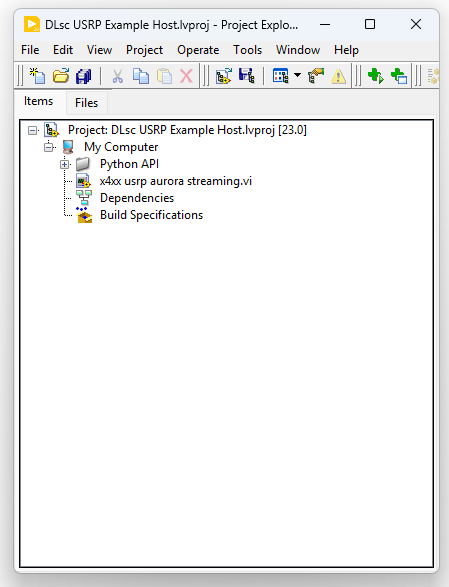
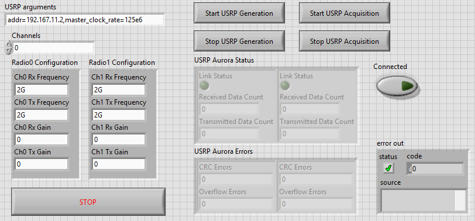

# USRP Aurora Control Example

This example demonstrates X4xx USRP control for Aurora streaming for multichannel operation.

<blockquote>
<strong>Important:</strong> This example must be executed together with a compatible Aurora endpoint application running on an NI high-speed serial device. To establish the Aurora link and enable data transfer, the corresponding example must be running simultaneously on either a <strong>PXIe-7903 FPGA Coprocessor</strong> or a <strong>PXIe-6594 High-Speed Serial Instrument</strong>. For additional information, refer to the NI Data Link Test Framework documentation.
</blockquote>
<ol>
<li>
Download and open <strong>DLsc USRP Example Host.lvproj</strong>, which contains all required project files and VIs. The main application VI is <strong>x4xx usrp aurora streaming.vi</strong>.

  
  

</li>
<li>
Launch the VI and review the front panel configuration options described below.
<ul>
<li>
<strong>USRP arguments</strong> control is used to configure the USRP IP address and master clock rate of the USRP. For the <strong>USRP X420</strong>, the supported master clock rates are <strong>250 MS/s</strong> and <strong>1250 MS/s</strong>. For the <strong>USRP X440</strong>, refer to the appropriate documentation for supported master clock rate values.
</li>
<li>
<strong>Channels</strong> control specifies which RF channel(s) are enabled for both transmit (Tx) and receive (Rx) operation. The following channel configurations are supported:

<ul>
<li><strong>0</strong> – Enables Channel 0 only, corresponding to TX/RX0 and RX1 antenna ports of Daughterboard 0 (DB0).</li>
<li><strong>1</strong> – Enables Channel 1 only, corresponding to TX/RX0 and RX1 antenna ports of Daughterboard 1 (DB1).</li>
<li><strong>0,1</strong> – Enables both Channel 0 (DB0) and Channel 1 (DB1) simultaneously for multi-channel operation.</li>
</ul>
</li>
</ul>
</li>

<ul>
<li>
The <strong>Radio0 Configuration</strong> and <strong>Radio1 Configuration</strong> controls provide RF configuration settings for <strong>Channel 0</strong> and <strong>Channel 1</strong>, respectively. Each configuration panel allows independent adjustment of the channel's transmit and receive parameters, including center frequency and gain settings.
</li>
<li>
The front panel also provides real-time monitoring of the Aurora links:
<ul>
<li>
<strong>Link Status</strong> indicates whether the Aurora connection has been successfully established.
</li>
<li>
<strong>Received Data Count</strong> displays the number of received Aurora packets.
</li>
<li>
<strong>Transmitted Data Count</strong> displays the number of transmitted Aurora packets.
</li>
<li>
<strong>CRC Errors</strong> reports packet integrity errors detected by the Aurora interface.
</li>
<li>
<strong>Overflow Errors</strong> reports data-flow errors caused by insufficient processing or buffering resources.
</li>
</ul>
</li>
</ul>

  
  

  
</ol>

<h2>Running the Example</h2>
<ol>
<li>
First, deploy and start the corresponding Aurora endpoint application on the
PXIe-7903 FPGA Coprocessor or PXIe-6594 High-Speed Serial Instrument.
These examples are delivered with the NI Data Link Test Framework.
</li>
<li>
Wait for the Aurora endpoint application to complete initialization and report
a valid link status on the PXIe module.
</li>
<li>
Run <strong>x4xx usrp aurora streaming.vi</strong>. Wait until the
<strong>Connected</strong> indicator on the front panel becomes TRUE,
indicating successful communication with the USRP.
</li>
<li>
Enable the Aurora link on the PXIe module.
</li>
<li>
Click <strong>Start USRP Generation</strong> to begin transmit-side streaming.
</li>
<li>
Click <strong>Start USRP Acquisition</strong> to begin receive-side streaming.
</li>
<li>
Click <strong>Stop USRP Generation</strong> to stop transmit-side streaming.
</li>
<li>
Click <strong>Stop USRP Acquisition</strong> to stop receive-side streaming.
</li>
</ol>
